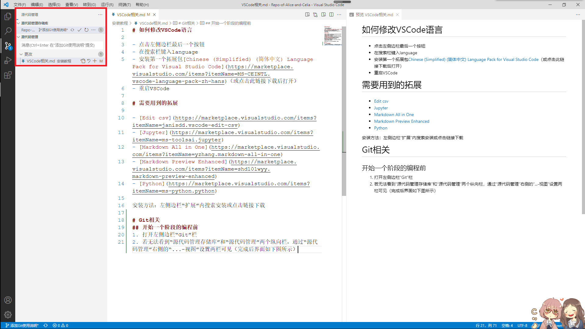
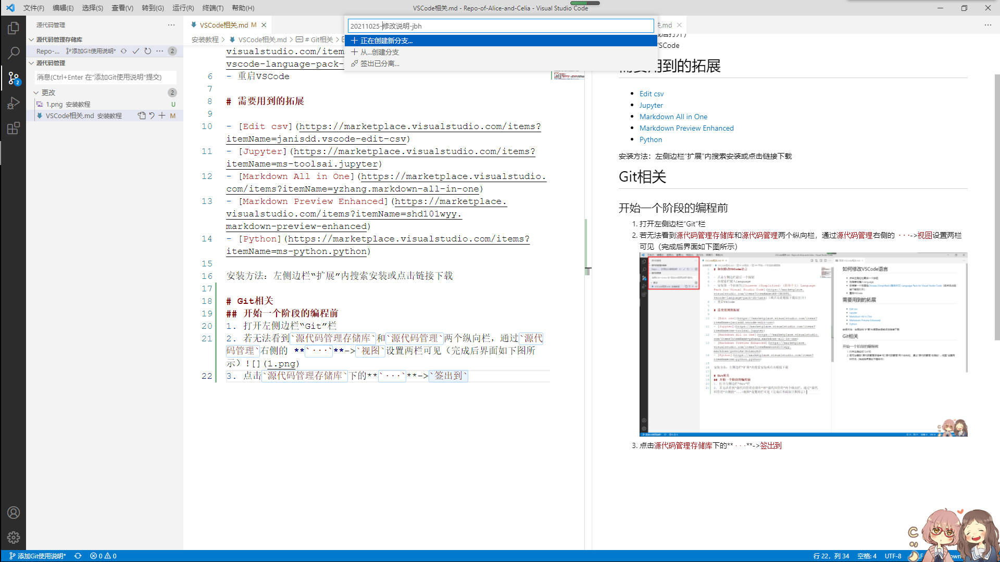
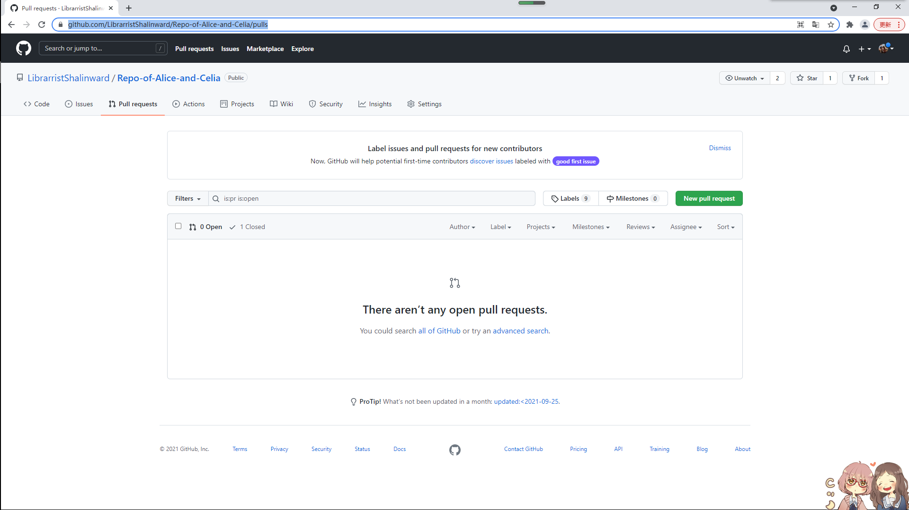
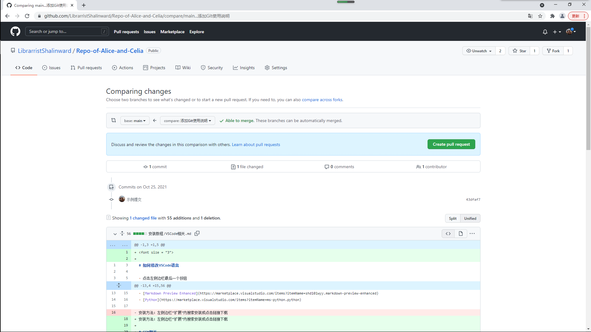

# 如何修改VSCode语言

- 点击左侧边栏最后一个按钮
- 在搜索栏键入language
- 安装第一个拓展包[Chinese (Simplified) (简体中文) Language Pack for Visual Studio Code](https://marketplace.visualstudio.com/items?itemName=MS-CEINTL.vscode-language-pack-zh-hans)（或点击此链接下载后打开）
- 重启VSCode

# 需要用到的拓展

- [Edit csv](https://marketplace.visualstudio.com/items?itemName=janisdd.vscode-edit-csv)
- [Jupyter](https://marketplace.visualstudio.com/items?itemName=ms-toolsai.jupyter)
- [Markdown All in One](https://marketplace.visualstudio.com/items?itemName=yzhang.markdown-all-in-one)
- [Markdown Preview Enhanced](https://marketplace.visualstudio.com/items?itemName=shd101wyy.markdown-preview-enhanced)
- [Python](https://marketplace.visualstudio.com/items?itemName=ms-python.python)

安装方法：左侧边栏“扩展”内搜索安装或点击链接下载

# Git相关

## 开始一个阶段的编程前
1. 打开左侧边栏“Git”栏
   
2. 若无法看到`源代码管理存储库`和`源代码管理`两个纵向栏，通过`源代码管理`右侧的 **`···`**->`视图`设置两栏可见（完成后界面如下图所示）[设置Git菜单全部可见](./1.png)
   
3. 点击`源代码管理存储库`下的 **`···`**->`签出到`，在弹出的输入栏中输入新的分支（branch）名称（不妨统一格式为“*日期*-**内容**-***修改者***”，如“*20211025*-**修改说明**-***jbh***”，实际输入时不加引号），如下图所示。完成后后按`Enter`即可创建新的分支[创建新的branch](./2.png)
   
4. 点击自动弹出的蓝色按钮或`源代码管理存储库`下的$\rightleftarrows$双箭头将分支同步至GitHub库
   
5. 开始新的一段编程

<strong>

### **重要：**

如果开始编程后发现忘了执行以上步骤：

|情况|犯大病程度|操作|
|----|----|----|
|已经修改了一些文档但没有保存过|:):)|<u>立刻保存后停止修改</u>，完成上述步骤|
|文档保存过但还没有通过Git保存修改（下一节）|:):)|<u>立刻停止修改</u>，完成上述步骤|
|已经通过Git保存修改但还未提交|:):)|同上|
|（以上三情况，但无论出现什么提示都不要选择提交修改至分支）|
|已经提交修改至本地|:\| :\||出大问题（单独联系jbh解决）|
|已经同步修改至GitHub|:(:(|几乎已经凉透了（单独联系jbh解决）|

否则。。。。。。你的修改可能会直接覆盖掉别人的:skull::skull::skull::skull::skull:

</strong>

## 保存修改至Git

- 点击`源代码管理`-`更改`右侧的 **`+`**即可。或点击`源代码管理`-`更改`下各文件名右侧的 **`+`**选择要提交修改的文件，点击 $\curvearrowleft$撤销修改（修改内容被永久删除）

## 提交修改至分支

1. 在`源代码管理`下的输入栏中输入修改说明（不妨统一格式为“*日期*-**内容**”，如“*20211025*-**添加Git说明**”，实际输入时不加引号），完成后按`Ctrl+Enter`提交（可在不保存修改至Git的情况下进行，此时将保存所有修改）
   
2. （可选，推荐提交若干次修改至分支之后再进行）点击`源代码管理存储库`下的“x$\downarrow$x$\uparrow$”按钮，将所有未提交修改同步至GitHub库的对应分支

## 合并当前分支至主分支

**强调：严禁直接在本地或云端（GitHub）合并自己的分支至main/master主分支，这将跳过代码的比较检测流程，可能或导致代码合并冲突**

1. 点击`源代码管理存储库`下的“x$\downarrow$x$\uparrow$”按钮或$\rightleftarrows$双箭头，确认已将所有未提交修改分支同步至GitHub库的对应分支
   
2. 打开GitHub网页端，进入[repo页面](https://github.com/LibrarristShalinward/Repo-of-Alice-and-Celia)，点击`Pull request`进入[拉取申请页面](https://github.com/LibrarristShalinward/Repo-of-Alice-and-Celia/pulls)[Pull Request页面](./3.png)
   
3. 点击`Pull request`，进入发起页面
   
4. 在`compare`一栏选择自己的分支，确认修改后点击`Create pull request`发起申请[修改对比页面](./4.png)
   
5. 在新页面添加修改说明（可选），点击`Create pull request`发起申请，等待其余人确认（当前设置为2人确认才可以提交）